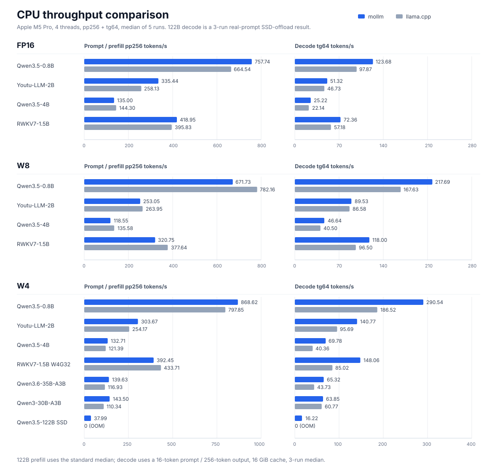
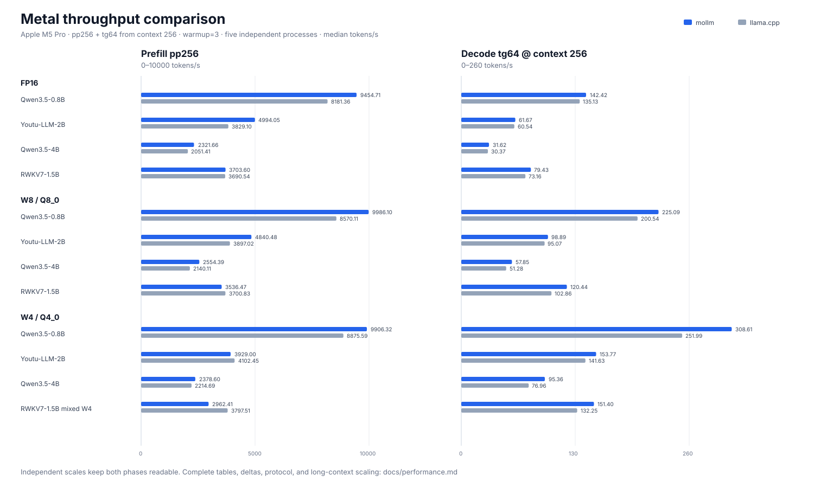

# Performance

This page collects the CPU and Metal benchmark results used by the README.

## CPU

These results compare mollm with llama.cpp on an Apple M5 Pro using four CPU
threads. Unless a row says otherwise, the protocol is `pp256 + tg64`,
`warmup=3`, five independent processes, and the median throughput. `pp` is
prompt/prefill tokens per second; `tg` is generated/decode tokens per second.

## FP16

On Apple platforms, mollm uses Accelerate SGEMM for eligible large FP16
prefill GEMMs.

| Model | mollm pp/tg | llama.cpp pp/tg | Result |
|---|---:|---:|---|
| Qwen3.5-0.8B | **757.74** / **123.68** | 664.54 / 97.87 | mollm faster prefill and decode |
| Youtu-LLM-2B | **335.44** / **51.32** | 258.13 / 46.73 | mollm faster prefill and decode |
| Qwen3.5-4B | 135.00 / **25.22** | **144.30** / 22.14 | llama faster prefill, mollm faster decode |
| RWKV7-1.5B | **418.95** / **72.36** | 395.83 / 57.18 | mollm faster prefill and decode |

## W8

| Model | mollm W8 pp/tg | llama.cpp Q8_0 pp/tg | Result |
|---|---:|---:|---|
| Qwen3.5-0.8B | 671.73 / **217.69** | **782.16** / 167.63 | llama faster prefill, mollm faster decode |
| Youtu-LLM-2B | 253.05 / **89.53** | **263.95** / 86.58 | close prefill, mollm slightly faster decode |
| Qwen3.5-4B | 118.55 / **46.64** | **135.58** / 40.50 | llama faster prefill, mollm faster decode |
| RWKV7-1.5B | 320.75 / **118.00** | **377.64** / 96.50 | llama faster prefill, mollm faster decode |

## W4

All four dense/recurrent rows were refreshed on 2026-07-26 with current
packages and binaries. The dense transformer rows use BG128, with one A8 scale
per 128-value group. RWKV7 instead uses mixed W4G32: its large matrices use
32-value groups, while the vocabulary projection and small low-rank attention
adapters remain W8. Qwen3.5-4B uses a package generated by the current
converter, including fused gate/up, QKV, and linear-attention input
projections.

| Model | mollm W4 pp/tg | llama.cpp Q4_0 pp/tg | Result |
|---|---:|---:|---|
| Qwen3.5-0.8B | **868.62** / **290.54** | 797.85 / 186.52 | mollm 1.09x prefill, 1.56x decode |
| Youtu-LLM-2B | **303.67** / **140.77** | 254.17 / 95.69 | mollm 1.19x prefill, 1.47x decode |
| Qwen3.5-4B | **132.71** / **69.78** | 121.39 / 40.36 | mollm 1.09x prefill, 1.73x decode |
| RWKV7-1.5B mixed W4G32 | 392.45 / **148.06** | **433.71** / 85.02 | llama 1.11x prefill, mollm 1.74x decode |

RWKV7 uses sparse-A FFN GEMV where it improves endpoint performance. Its
W4G32 package reaches `7.020762` PPL on the complete
`calibration_data_v5_rc.txt` corpus, closely matching llama.cpp Q4_0 quality.

## MoE W4

| Model | mollm W4 pp/tg | llama.cpp Q4_0 pp/tg | Result |
|---|---:|---:|---|
| Qwen3.6-35B-A3B | **139.63** / **65.32** | 116.93 / 43.73 | mollm 1.19x prefill, 1.49x decode |
| Qwen3-30B-A3B | **143.50** / **63.85** | 110.34 / 60.77 | mollm 1.30x prefill, 1.05x decode |
| Qwen3.5-122B-A10B (SSD offload) | **51.06** / **16.53** † | OOM | runs on a 48GB Mac |

† Prefill was refreshed on 2026-07-27 and is the five-process
`pp256 + tg64`, `warmup=3` median with a 16 GiB expert RAM cache. Decode is the
current three-process median on a real ChatML prompt with 16 prompt tokens,
256 generated tokens, `warmup=0`, and the same cache size. See [SSD
offload](ssd-offload.md) for the cache sweep and I/O protocol.

## Native FP8 + MXFP4

| Model | mollm pp/tg | llama.cpp pp/tg | Result |
|---|---:|---:|---|
| DeepSeek-V4-Flash (SSD offload) | **9.35** / **4.74** ‡ | 0 / 0 | llama.cpp OOM |

‡ Provisional single-process result using four CPU threads, `pp256 + tg64`,
`warmup=3`, and a 16 GiB expert RAM cache. This is not yet the usual
five-process median.

Packages are resident by default. `--mmap` remains available for CPU A/B
testing; mmap page warmup is reported separately from measured prefill and
decode time.

## Metal

Metal support is experimental. The current optimized path covers resident
FP16, W8, and W4 packages. Results below use the same Apple M5 Pro, four CPU
threads, `warmup=3`, five independent processes, and median throughput.

For mollm, `--prompt-tokens 256 --max-new-tokens 65` produces one 256-token
prefill pass and exactly 64 timed decode tokens. For llama.cpp, prefill and
decode are separate processes: `-p 256 -n 0` and `-p 0 -n 64 -d 256`. The latter matters:
it measures tg64 with an existing 256-token context rather than the faster
empty-context decode path. Both runtimes keep model weights on Metal.

### FP16

| Model | mollm Metal pp/tg | llama.cpp Metal pp/tg | Decode difference |
|---|---:|---:|---:|
| Qwen3.5-0.8B | **9454.71** / **142.42** | 8181.36 / 135.13 | +5.4% |
| Youtu-LLM-2B | **4994.05** / **61.67** | 3829.10 / 60.54 | +1.9% |
| Qwen3.5-4B | **2321.66** / **31.62** | 2051.41 / 30.37 | +4.1% |
| RWKV7-1.5B | **3703.60** / **79.43** | 3690.54 / 73.16 | +8.6% |

### W8

| Model | mollm Metal W8 pp/tg | llama.cpp Metal Q8_0 pp/tg | Decode difference |
|---|---:|---:|---:|
| Qwen3.5-0.8B | **9986.10** / **225.09** | 8570.11 / 200.54 | +12.2% |
| Youtu-LLM-2B | **4840.48** / **98.89** | 3897.02 / 95.07 | +4.0% |
| Qwen3.5-4B | **2554.39** / **57.85** | 2140.11 / 51.28 | +12.8% |
| RWKV7-1.5B | 3536.47 / **120.44** | **3700.83** / 102.86 | +17.1% |

### W4

| Model | mollm Metal W4 pp/tg | llama.cpp Metal Q4_0 pp/tg | Decode difference |
|---|---:|---:|---:|
| Qwen3.5-0.8B | **9906.32** / **308.61** | 8875.59 / 251.99 | +22.5% |
| Youtu-LLM-2B | 3929.00 / **153.77** | **4102.45** / 141.63 | +8.6% |
| Qwen3.5-4B | **2378.60** / **95.36** | 2214.69 / 76.96 | +23.9% |
| RWKV7-1.5B mixed W4 | 2962.41 / **151.40** | **3797.51** / 132.25 | +14.5% |

Qwen3.5 row-concatenates projections that consume the same activation: MLP
gate/up, full-attention Q/K/V, and linear-attention QKV/A/B/Z. The graph
therefore performs one matmul and takes zero-copy slices instead of launching
several smaller matmuls and rereading the activation. Residual addition is
also fused with the following RMSNorm, and full attention fuses its sigmoid
output gate. The linear-attention fusion removes two matmul dispatches from
every Gated DeltaNet layer; strided ShortConv and GDN inputs consume the
resulting views directly without a materializing copy. Decode further fuses
ShortConv with Gated DeltaNet, while full attention fuses per-head RMSNorm,
materialization, and RoPE. Quantized `lm_head` projection stays on Metal
instead of falling back to CPU for every generated token.

FP16 and W8 prefill cast each reused FP32 activation matrix to FP16 once, then
use FP16-input tensor GEMM for activation-bearing projections. FP16 reads both
operands directly as device tensors; W8 dequantizes weights while staging.
W8 selects separately compiled M64xN64 or M128xN64 cooperative tiles from the
matrix dimensions, keeping occupancy high on smaller projections without
regressing large gate/up and down projections.
This reduces the activation working set and repeated device reads while
retaining FP32 accumulation.
K=128 Gated DeltaNet prefill keeps each state row in SIMD-group registers
across the sequence, matching the recurrent structure used by llama.cpp.
This makes Qwen3.5-0.8B and Qwen3.5-4B faster than llama.cpp in both prefill
and decode across all three tested precisions.

RWKV7 prefill assigns one workgroup to each 64-wide head. Its 16 KiB FP32
state matrix remains in threadgroup memory for the whole sequence, while each
token's R/W/K/A/B vectors are loaded once per head. This removes per-token
global state traffic and redundant per-row vector reads. FP16 prefill now
slightly exceeds llama.cpp; W8 is within 5%, up from less than half of
llama.cpp before this change. Decode keeps the row-parallel kernel to avoid
prefill's synchronization cost.

W4 now uses a correctness-aware balanced path by default. Unactivated
projections retain FP32 activations while unpacking weights to half for tensor
GEMM, with dimension-selected M64xN64 and M128xN64 cooperative tiles. Fused
gate/up projections quantize activations in K64 blocks and reuse
package-native BG128 weights; two K32 integer tensor operations are accumulated
before FP32 dequantization. Both K32 halves are staged together. For
`K > 1024`, each thread keeps its FP32 output partials in registers, while the
small activation and weight-scale vectors reuse the existing cooperative-store
barrier. K1024 retains the lower-register-pressure shared-partial kernel. This
reduces synchronization, shared-memory traffic, and the large-K threadgroup
footprint without changing integer accumulation or scale boundaries.
`MOLLM_METAL_W4_PREFILL_MODE=accurate` remains available for full-output K32
diagnostics.

On the pathological 512-token Youtu sample, default Metal PPL is now
`82.5373` versus CPU `84.1760`, a -1.95% difference. The previous all-half
path that produced a +7.71% gap is no longer used. Five repeated Metal runs
produced identical CE/PPL. The balanced path
also keeps 0.8B and 4B within -0.19% and -0.13% of their CPU PPL, respectively.
Register-resident partials, scale staging, and dimension-selected cooperative
tiles lift the Youtu prefill median from `3287.35` to `3929.00` tok/s (+19.5%).
Youtu now trails llama.cpp prefill by 4.2%; decode remains 8.6% faster through
a separate GEMV path.

### Youtu W4 context scaling

The context-256 row below is the current five-process matrix result. The 1024-
and 4096-token rows are earlier three-process medians used to show scaling.

| tg64 starting context | mollm Metal | llama.cpp Metal | Difference |
|---|---:|---:|---:|
| 256 | **153.77 t/s** | 141.63 t/s | +8.6% |
| 1024 | **133.23 t/s** | 131.35 t/s | +1.4% |
| 4096 | 88.52 t/s | **93.02 t/s** | -4.8% |

Youtu's `DK=192, DV=128` decode path fuses QK, online softmax, and P×V. At
context 768 and above, 32 workgroups per head produce independent online
softmax states and a second kernel combines them. Qwen3.5's full-attention
`DK=DV=256` decode uses the same single-pass online-softmax structure at
short and medium contexts, avoiding the generic path's full score buffer and
separate score, softmax, and value passes.

Correctness gates include Metal operator parity at past lengths from 0 through
1023 with `3e-3` tolerance, finite CPU/Metal CE and PPL, exact deterministic
Youtu W4 generation, and the complete Metal CTest suite.
